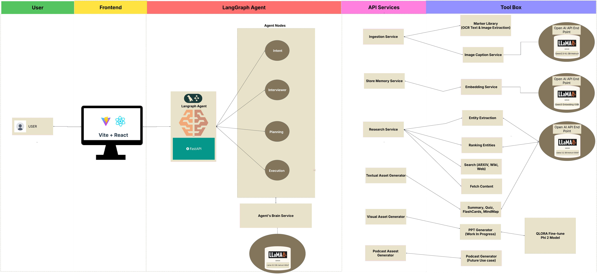

# PaperEngine.ai
### The Intelligent Multi-Modal Research & Learning Assistant

**PaperEngine.ai** is a comprehensive AI platform designed to transform complex research papers and academic documents into structured, multi-modal learning assets. By leveraging a sophisticated multi-agent orchestration layer, it automates document ingestion, visual analysis of scientific figures, real-time research, and the generation of interactive study tools like quizzes, presentations, and mind maps.

---

## 🏗️ System Architecture
The system is built on a modular, containerized microservices architecture to ensure high-fidelity outputs and scalability.



* **Frontend:** A modern Vite + React interface featuring a conversational research environment, floating academic-themed backgrounds, and specialized artifact viewers.
* **Orchestration (LangGraph Agent):** A state-machine-driven agent that manages user intent routing, maintains session state, and executes multi-step research plans.
* **API Gateway:** The central entry point managing sessions and streaming real-time progress updates from the agent to the frontend.
* **Specialized Microservices:**
    * **Brain Service:** Powers high-level reasoning and RAG-based answering using **Llama-3.2-3B**.
    * **Vision Service:** Analyzes complex scientific figures and data trends using **Qwen2.5-VL**.
    * **Embedding Service:** Vectorizes content for semantic search via **Qwen3-Embedding**.
    * **Atomic Services:** Core tools for PDF conversion (Marker), academic scraping (Arxiv, Wikipedia), and asset generation.

---

## 🚀 Key Features

### 📄 Intelligent Multi-Modal Ingestion
* **High-Fidelity PDF Parsing:** Converts scientific PDFs into clean Markdown using the Marker library.
* **Visual Figure Enrichment:** Automatically extracts and captions images, charts, and diagrams within papers to maintain context through Vision LLMs.

### 🔍 Automated Research & RAG
* **Hybrid Search:** Synthesizes data from Arxiv, Wikipedia, and DuckDuckGo to ground agent responses in factual evidence.
* **Semantic Memory:** Stores document insights in a ChromaDB vector store for context-aware retrieval and long-term research continuity.

### 🎨 Advanced Asset Generation
* **Fine-Tuned Presentation Architect:** Utilizes a Phi-2 model fine-tuned via QLoRA to architect professional presentation blueprints from raw document context.
* **Comprehensive Study Suite:** Generates dynamic Quizzes, Flashcards, Mermaid.js Mind Maps, and YouTube/Podcast scripts tailored to user learning styles.

---

## 🛠️ Model Inventory
The system utilizes specialized **GGUF** models for efficient local inference:

| Component | Model | File | Size |
| :--- | :--- | :--- | :--- |
| **Brain** (Text Agent) | Llama-3.2-3B-Instruct | `Llama-3.2-3B-Instruct-Q4_K_M.gguf` | ~1.97GB |
| **Vision** (The Eyes) | Qwen2.5-VL-3B-Instruct | `Qwen2.5-VL-3B-Instruct-q4_k_m.gguf` | ~1.88GB |
| **Vision Adapter** | Qwen2.5-VL-3B-Instruct | `mmproj-f16.gguf` | ~1.3GB |
| **Embedding** | Qwen3-Embedding-0.6B | `Qwen3-Embedding-0.6B-f16.gguf` | ~1.17GB |

---

## 🧠 Agentic Workflow
The PaperEngine Agent follows a strict logical sequence to ensure high-fidelity outputs:

1. **Intent Router:** Determines if the user intent is casual chat, a research question, or a document-based study task.
2. **Interviewer:** Probes for specific user preferences (Learning Style/Depth) if they have not been established.
3. **Planner:** Constructs a dynamic execution plan (e.g., Ingest PDF -> Research Gaps -> Store Memory -> Generate Assets).
4. **Executor:** Iteratively calls specialized microservice tools until the plan is fulfilled and the artifacts are ready for review.

---

## 🚦 Getting Started

### 1. Model Synchronization
Download the necessary GGUF model weights and adapters to the `models/` directory:
```bash
python download_models.py
```
### 2. Deployment with Docker
Launch the entire ecosystem—including the brain, vision, embedding, and atomic services—using Docker Compose:
```bash
docker-compose up --build
```
### 3. Usage
Upon startup, the agent will prompt for your Learning Style (Reading, Watching, Listening) and Depth Level (Layman, Researcher) to customize all generated artifacts.

---
## 📂 Project Structure: PaperEngine.ai

```text
PaperEngine.ai/
├── backend/
│   ├── core/
│   │   ├── agent_graph.py           # LangGraph orchestration and state management
│   │   ├── atomic_services.py       # Core tools (Search, PDF Ingestion, Memory)
│   │   ├── brain_service.py         # Llama-3.2-3B engine manager
│   │   ├── embedding_service.py     # Qwen3-Embedding engine manager
│   │   ├── image_caption_service.py # Qwen2.5-VL vision engine manager
│   │   └── prompts.py               # Prompt templates for study assets
        └── prompts.py
│   ├── inference/
│   │   ├── api_gateway.py           # Central FastAPI gateway & streaming
│   │   ├── inference_generator.py   # Fine-tuned Phi-2 inference logic
│   │   └── pptx_service.py          # PPTX assembly & Phi-2 blueprinting
│   └── training/
│       └── Qlora_Finetuning_Phi3.py # Phi-2 QLoRA training script
├── frontend/                        # Vite + React Frontend
│   ├── src/
│   │   ├── App.jsx                  # Main UI & Agent interaction logic
│   │   ├── main.jsx                 # React entry point
│   │   └── index.css                # Global styles and hero animations
│   └── package.json
├── models/                          # GGUF Model weights and adapters
│   ├── Llama-3.2-3B-Instruct-Q4_K_M.gguf
│   ├── Qwen2.5-VL-3B-Instruct-q4_k_m.gguf
│   └── final_phi_json_adapter/      # Trained LoRA weights
├── data/
│   ├── chroma_db/                   # Persistent vector storage
│   └── images/                      # Extracted document images
├── uploads/                         # Temporary user-uploaded PDFs
├── docker-compose.yml               # Multi-container orchestration
├── dockerfile                       # Backend container definition
├── requirements.txt                 # Python dependencies
└── download_models.py               # Model synchronization utility


